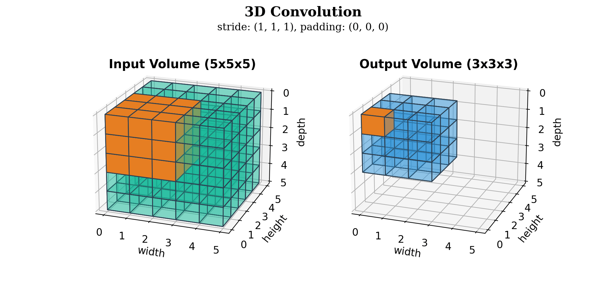

# Animations of 3D Convolutions in Python

This repository contains a script to generate animations (in *.gif* or *.pdf* format) of 3D convolutions in Python.

| Default | Dark Mode |
| :---: | :---: |
|  |  |

## Requirements

Required Python packages are listed in *requirements.txt* and can be installed with:

```bash
pip install -r requirements.txt
```

## Usage

The script *visiualize_3d_conv.py* can be used to generate animations of 3D convolutions. The script takes the following arguments:

```bash
usage: visualize_3d_conv.py [-h] [--to-pdf | --no-to-pdf] [--dark-mode | --no-dark-mode]

options:
  -h, --help            show this help message and exit
  --to-pdf, --no-to-pdf
                        Save animation as pdfs instead of gif (default: False)
  --dark-mode, --no-dark-mode
                        Use dark mode (default: False)
```

For example, to generate animations of 3D convolutions in dark mode and save them as *.pdf* files, run:

```bash
python visualize_3d_conv.py --to-pdf --dark-mode
```

## Configuration

The script *visualize_3d_conv.py* can be configured by changing the values of the constants available in `constants.py`.

## License

This repository is licensed under the MIT License. See [LICENSE](./LICENSE) for more information.
